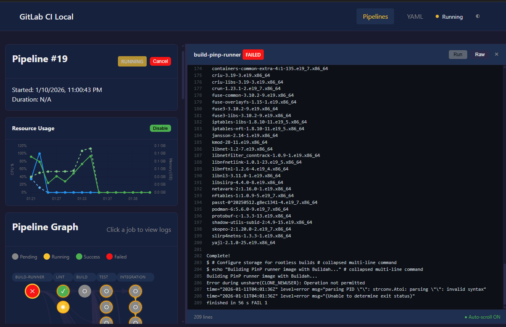

# Changelog

All notable changes to this project will be documented in this file.

The format is based on [Keep a Changelog](https://keepachangelog.com/en/1.0.0/),
and this project adheres to [Semantic Versioning](https://semver.org/spec/v2.0.0.html).

## [Unreleased] - Fork Enhancements

### Web UI

Complete web-based pipeline execution and monitoring interface via `gitlab-ci-local serve`.

- **Pipeline Visualization** - DAG graph with job dependencies, stages, and status indicators
  - Interactive job nodes with click-to-view-logs
  - Manual job triggers with selection dialog
  - Run individual jobs, stages, or full pipelines
  - Cancel running pipelines
- **Live Monitoring** - Real-time pipeline execution feedback
  - Log streaming with ANSI color support and auto-scroll
  - Initialization progress phases (parsing, includes, syncing)
  - Pipeline/job status updates via Server-Sent Events
- **Resource Monitoring** - Docker container CPU/memory metrics
  - Real-time Chart.js graphs with dual Y-axes
  - Peak and average resource tracking per job
  - 120-second rolling history window
- **Theme Support** - Light/Dark/System preference toggle with localStorage persistence
- **Artifact Browser** - Download artifacts per job with file size display
- **YAML Viewer** - Source vs expanded configuration comparison with syntax highlighting
- **Pipeline History** - List recent pipelines with status and duration

### Core Enhancements

Improvements to the original gitlab-ci-local project (not web-specific).

- **Rsync Caching** - Skip file sync when git state unchanged
  - Hash-based cache in `.gitlab-ci-local/rsync-cache-{target}.txt`
  - Checks HEAD commit, uncommitted changes, and untracked files
- **Docker Socket Auto-Detection** - Automatic DOCKER_HOST configuration
  - Supports Linux, WSL, Docker Desktop (macOS), and alternative socket paths
- **GitLab !reference Tag Support** - Proper YAML parsing for `!reference [path]` syntax
- **Bundled GitLab Templates** - Offline access to Security/Workflow templates
  - Template includes work without internet connectivity
- **Pipeline IID Synchronization** - Consistent IDs between web UI and CLI execution
- **Docker Security Options** - New `--security-opt` flag for Docker executor
  - Pass options like `seccomp=unconfined` or `apparmor=unconfined`

### Bug Fixes

- Fixed non-object YAML entry handling (prevents crashes with mixed anchors)
- Fixed job event matching for web UI-triggered pipelines
- Fixed schema validation for gitlab-ci-local specific properties (privileged, mountCache, etc.)

### Developer Experience

Build system and tooling improvements.

- **Development Containers**
  - `Dockerfile.dev` - Multi-stage Node.js + Docker-in-Docker (150MB)
  - `Dockerfile.helper` - Minimal Alpine utility image (3.5MB)
- **Build Scripts**
  - `scripts/build-linux.sh` - Containerized binary building
  - `scripts/dev-serve.sh` - Hot-reload development server
  - `scripts/generate-embedded.ts` - Frontend asset bundler (CSS + JS to single HTML)
  - `scripts/generate-bundled-templates.ts` - GitLab template caching
- **Testing Infrastructure**
  - Comprehensive web UI test suite (133 tests, 4700+ lines)
  - `npm run test-except-dind` for faster local testing
- **CI/CD Pipeline** - DAG-based parallel builds with multi-platform binary outputs
- **CLAUDE.md** - AI assistant guidance for codebase navigation
