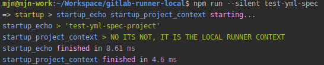

## Introduction
Are you tired of pushing commits to test your Gitlab CI?

Then this is the tool for you.

It lets you run a Gitlab CI pipeline on your local machine.

## Table of contents
* [Introduction](#introduction)
* [Table of contents](#table-of-contents)
* [Installation](#installation)
    * [NPM](#npm)
    * [Linux](#linux)
    * [Windows (Git bash)](#windows-git-bash)
    * [Macos](#macos)
* [Usage](#usage)
    * [Example](#example)
    * [Convinience](#convinience)
        * [Bash alias](#bash-alias)
        * [Bash completion](#bash-completion)
    * [Quirks](#quirks)
        * [Artifacts](#artifacts)
* [Development](#development)
    * [Scripts](#scripts)
    * [Package binaries](#package-binaries)
    * [Will not be implemented](#will-not-be-implemented)

## Installation
### NPM
```
npm install -g gitlab-ci-local
```

### Linux
Download and put binary in `/usr/local/bin`

```
sudo su # must be installed as root, if placed in /usr/local/bin/
curl -L https://github.com/firecow/gitlab-ci-local/releases/latest/download/linux.gz | gunzip -c > /usr/local/bin/gitlab-ci-local
chmod +x /usr/local/bin/gitlab-ci-local
exit
```
    
### Windows (Git bash)
Install [gitbash](https://git-scm.com/downloads)

Download and put binary in `C:\Program Files\Git\mingw64\bin`

```
curl -L https://github.com/firecow/gitlab-ci-local/releases/latest/download/win.gz | gunzip -c > /c/Program\ Files/Git/mingw64/bin/gitlab-ci-local.exe
```

### Macos
Download and put binary in `/usr/local/bin`

```
sudo su # must be installed as root, if placed in /usr/local/bin/
curl -L https://github.com/firecow/gitlab-ci-local/releases/latest/download/macOS.gz | gunzip -c > /usr/local/bin/gitlab-ci-local
chmod +x /usr/local/bin/gitlab-ci-local
exit
```

## Usage
### Example

```
# /home/user/workspace/myproject/.gitlab-ci.yml
---
stages: [ .post ]

# @Description Is only executed locally
clean:
  stage: .post
  rules:
    - { if: $GITLAB_CI == 'false', when: manual }
  script:
    - echo "I'm only executed locally because GITLAB_CI is false via gitlab-ci-local"
    - echo "I also have a description, when gitlab-ci-local --list is executed"


cd /home/user/workspace/myproject
gitlab-ci-local
```

### Convinience
#### Bash alias
```
echo "alias gcl='gitlab-ci-local'" >> ~/.bashrc
```

#### Bash completion

Add this to `~/.bashrc`
```
_yargs_completions()
{
    local cur_word args type_list

    cur_word="${COMP_WORDS[COMP_CWORD]}"
    args=("${COMP_WORDS[@]}")

    # ask yargs to generate completions.
    type_list=$(/usr/local/bin/gitlab-ci-local --get-yargs-completions "${args[@]}")

    COMPREPLY=( $(compgen -W "${type_list}" -- ${cur_word}) )

    # if no match was found, fall back to filename completion
    if [ ${#COMPREPLY[@]} -eq 0 ]; then
      COMPREPLY=()
    fi

    return 0
}
complete -o default -F _yargs_completions gitlab-ci-local
```

### Quirks
#### Artifacts
Artifacts works right now, as along as you don't overwrite tracked files.

## Development
### Scripts
```
npm install
npm run build
npm start -- --cwd /home/user/workspace/project-folder/
```



### Package binaries
```
npm run pkg-linux
npm run pkg-win
npm run pkg-macos
npm run pkg-all
```

### Will not be implemented
- cache
- pages
- resource_group
- interruptible
- only
- except
- parallel
- trigger
- retry (in case of failure)
- timeout (job max execution time)
- coverage (code coverage)
