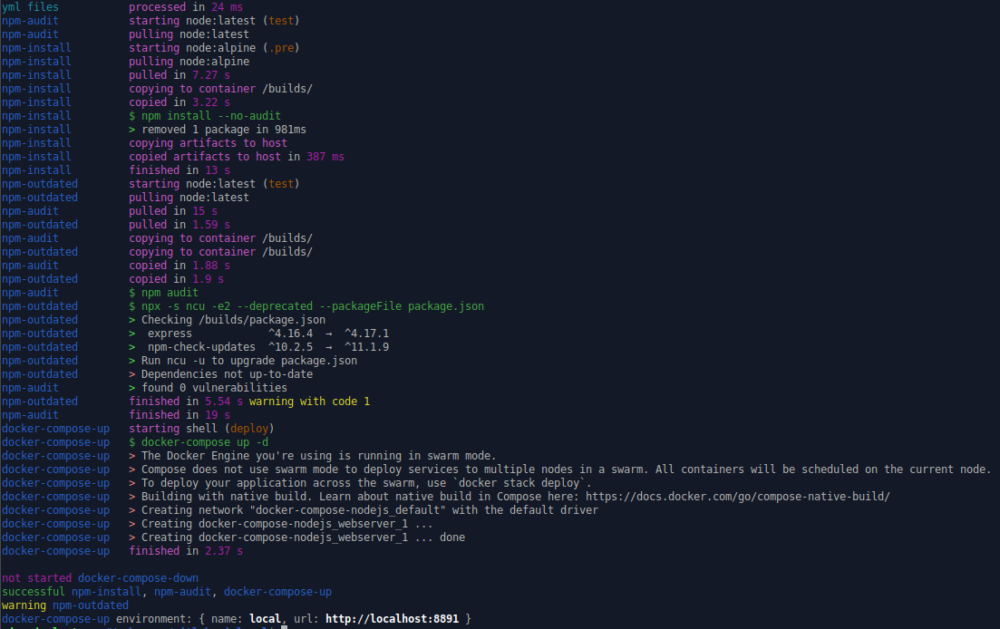

Tired of pushing to test your .gitlab-ci.yml?

Run gitlab pipelines locally as shell executor or docker executor.

Get rid of all those dev specific shell scripts and make files.

[](https://github.com/firecow/gitlab-ci-local/actions)
[](https://snyk.io/test/github/firecow/gitlab-ci-local)
[](https://npmjs.org/package/gitlab-ci-local)
[](https://npmjs.org/package/gitlab-ci-local)
[](https://renovatebot.com)

[](https://sonarcloud.io/dashboard?id=firecow_gitlab-ci-local)
[](https://sonarcloud.io/dashboard?id=firecow_gitlab-ci-local)
[](https://sonarcloud.io/dashboard?id=firecow_gitlab-ci-local)
[](https://sonarcloud.io/dashboard?id=firecow_gitlab-ci-local)

[](https://sonarcloud.io/dashboard?id=firecow_gitlab-ci-local)
[](https://sonarcloud.io/dashboard?id=firecow_gitlab-ci-local)
[](https://sonarcloud.io/dashboard?id=firecow_gitlab-ci-local)

## Table of contents

* [Examples](./examples)
    * [docker-compose-nodejs](./examples/docker-compose-nodejs)
    * [docker-swarm-php](./examples/docker-swarm-php)
    * [docker-in-docker-build](./examples/docker-in-docker-build)
* [Installation](#installation)
* [Convenience](#convenience)
    * [CLI options via shell](#cli-options-via-shell)
    * [DotEnv file](#dotenv-file)
    * [Bash alias](#bash-alias)
    * [Tab completion](#tab-completion)
    * [Listing jobs](#list-pipeline-jobs)
* [Quirks](#quirks)
    * [Tracked Files](#tracked-files)
    * [Local Only](#local-only)
    * [Home File Variables](#home-file-variables)
    * [Remote File Variables](#remote-file-variables)
    * [Project File Variables](#project-file-variables)
    * [Decorators](#decorators)
    * [Includes](#includes)
    * [Artifacts](#artifacts)
* [Development](#development)
    * [Scripts](#scripts)
    * [Package binaries](#package-binaries)

## Installation

### NPM

```bash
npm install -g gitlab-ci-local
```

### Linux based on Debian

Users of Debian-based distributions should prefer the [the Deb822 format][deb822], installed with:

```bash
sudo wget -O /etc/apt/sources.list.d/gitlab-ci-local.sources https://gitlab-ci-local-ppa.firecow.dk/gitlab-ci-local.sources
sudo apt-get update
sudo apt-get install gitlab-ci-local
```

  [deb822]: https://repolib.readthedocs.io/en/latest/deb822-format.html#deb822-format

If your distribution does not support this, you can run these commands:

```bash
curl -s "https://gitlab-ci-local-ppa.firecow.dk/pubkey.gpg" | sudo apt-key add -
echo "deb https://gitlab-ci-local-ppa.firecow.dk ./" | sudo tee /etc/apt/sources.list.d/gitlab-ci-local.list
sudo apt-get update
sudo apt-get install gitlab-ci-local
```

Note that the path `/etc/apt/sources.list.d/gitlab-ci-local.list` is used in the file `gitlab-ci-local.list`.
If you change it in these commands you must also change it in `/etc/apt/sources.list.d/gitlab-ci-local.list`.

### Macos

*bash version must be above or equal 4.x.x*

```bash
brew install gitlab-ci-local
```

### Windows (Git bash)

- Install [gitbash](https://git-scm.com/downloads)
- Install [rsync](https://prasaz.medium.com/add-rsync-to-windows-git-bash-f42736bae1b3)

Download and put binary in `C:\Program Files\Git\mingw64\bin`

```bash
curl -L https://github.com/firecow/gitlab-ci-local/releases/latest/download/win.gz | gunzip -c > /c/Program\ Files/Git/mingw64/bin/gitlab-ci-local.exe
```

Executing `gitlab-ci-local` with `--variable MSYS_NO_PATHCONV=1` can be useful in certain situations

## Convenience

### CLI options via shell

```
# Overrides .gitlab-ci.yml as the default git ci/cd file
export GCL_NEEDS='true' >> ~/.bashrc
export GCL_FILE='.gitlab-ci-local.yml' >> ~/.bashrc
export GLC_VARIABLES="IMAGE=someimage SOMEOTHERIMAGE=someotherimage"
```

### DotEnv file

Add a `.gitlab-ci-local-env` file to the current working directory or a `.env` file in `$HOME/.gitlab-ci-local`

```
# Overrides .gitlab-ci.yml as the default git ci/cd file
FILE=doctor-strange.yml # --file

# Always runs needed jobs, when gitlab-ci-local <job-name> is called
NEEDS=true # --needs
```

All cli options can be assigned default values this way

### Bash alias

```bash
echo "alias gcl='gitlab-ci-local'" >> ~/.bashrc
```

### Tab completion

```bash
gitlab-ci-local --completion >> ~/.bashrc 
```

### Logging options

```shell
export GCL_TIMESTAMPS=true # or --timestamps: show timestamps in logs
export GCL_MAX_JOB_NAME_LENGTH=30 # or --maxJobNameLength: limit padding around job name
export GCL_QUIET=true # or --quiet: Suppress all job output
```

### List Pipeline Jobs

Sometimes there is the need of knowing which jobs will be added before actually executing the pipeline.
GitLab CI Local is providing the ability of showing added jobs with the following cli flags.

#### --list

The command `gitlab-ci-local --list` will return pretty output and will also filter all jobs which are set
to `when: never`.

```text
name        description  stage   when        allow_failure  needs
test-job    Run Tests    test    on_success  false      
build-job                build   on_success  true           [test-job]
```

#### --list-all

Same as `--list` but will also print out jobs which are set to `when: never` (directly and implicit e.g. via rules).

```text
name        description  stage   when        allow_failure  needs
test-job    Run Tests    test    on_success  false      
build-job                build   on_success  true           [test-job]
deploy-job               deploy  never       false          [build-job]
```

#### --list-csv

The command `gitlab-ci-local --list-csv` will output the pipeline jobs as csv formatted list and will also filter all
jobs which are set
to `when: never`.
The description will always be wrapped in quotes (even if there is none) to prevent semicolons in the description
disturb the csv structure.

```text
name;description;stage;when;allow_failure;needs
test-job;"Run Tests";test;on_success;false;[]
build-job;"";build;on_success;true;[test-job]
```

#### --list-csv-all

Same as `--list-csv-all` but will also print out jobs which are set to `when: never` (directly and implicit e.g. via
rules).

```text
name;description;stage;when;allow_failure;needs
test-job;"Run Tests";test;on_success;false;[]
build-job;"";build;on_success;true;[test-job]
deploy-job;"";deploy;never;false;[build-job]
```

## Quirks

git+http isn't properly supported https://github.com/firecow/gitlab-ci-local/issues/605 and has certain quirks

### Tracked Files

Untracked and ignored files will not be synced inside isolated jobs, only tracked files are synced.

Remember `git add`

### Local Only

```yml
local-only-job:
  rules:
    - { if: $GITLAB_CI == 'false' }
```

```yml
local-only-subsection:
  script:
    - if [ $GITLAB_CI == 'false' ]; then eslint . --fix; fi
    - eslint . 
```

### Home file variables

Put a file like this in `$HOME/.gitlab-ci-local/variables.yml`

```yaml
---
project:
  gitlab.com/test-group/test-project.git:
    # Will be type Variable and only available if remote is exact match
    AUTHORIZATION_PASSWORD: djwqiod910321
  gitlab.com:project/test-group/test-project.git: # another syntax
    AUTHORIZATION_PASSWORD: djwqiod910321

group:
  gitlab.com/test-group/:
    # Will be type Variable and only available for remotes that include group named 'test-group'
    DOCKER_LOGIN_PASSWORD: dij3213n123n12in3

global:
  # Will be type File, because value is a file path
  KNOWN_HOSTS: '~/.ssh/known_hosts'
  DEPLOY_ENV_SPECIFIC:
    type: variable # Optional and defaults to variable
    values:
      '*production*': 'Im production only value'
      'staging': 'Im staging only value'
  FILE_CONTENT_IN_VALUES:
    type: file
    values:
      '*': |
        Im staging only value
        I'm great for certs n' stuff
```

Variables will now appear in your jobs, if project or group matches git remote, globals are always present

### Remote file variables

```shell
gitlab-ci-local --remote-variables git@gitlab.com:firecow/example.git=gitlab-variables.yml=master
```

### Project file variables

Put a file like this in `$CWD/.gitlab-ci-local-variables.yml`

```yaml
---
AUTHORIZATION_PASSWORD: djwqiod910321
DOCKER_LOGIN_PASSWORD: dij3213n123n12in3
# Will be type File, because value is a file path
KNOWN_HOSTS: '~/.ssh/known_hosts'
```

Variables will now appear in your jobs.

### Decorators

#### The `@Description` decorator

Adds descriptive text to `gitlab-ci-local --list`

```yml
# @Description Install npm packages
npm-install:
  image: node
  artifacts:
    paths:
      - node_modules/
  script:
    - npm install --no-audit
```


#### The `@Interactive` decorator

```yml
# @Interactive
interactive-shell:
  rules:
    - if: $GITLAB_CI == 'false'
      when: manual
  script:
    - docker run -it debian bash
```


#### The `@InjectSSHAgent` decorator

```yml
# @InjectSSHAgent
need-ssh:
  image: kroniak/ssh-client
  script:
    - ssh-add -L
```

#### The `@NoArtifactsToSource` decorator

Prevent artifacts from being copied to source folder

```yml
# @NoArtifactsToSource
produce:
  stage: build
  script: mkdir -p path/ && touch path/file1
  artifacts: { paths: [ path/ ] }
```

A global configuration is possible when setting the following flag

```shell
gitlab-ci-local --no-artifacts-to-source
```

### Includes

Includes from external sources are only fetched once. Use `--fetch-includes` to invoke an external fetching routine.

### Artifacts

Shell executor jobs copies artifacts to host/cwd directory. Use --shell-isolation option to mimic correct artifact
handling for shell jobs.

Docker executor copies artifacts to and from .gitlab-ci-local/artifacts

## Development

You need nodejs 18+

### Scripts

```bash
npm install
npm run build
npm run test
```



It's also possible to run individual `.gitlab-ci.yml`, via `./ts-node --cwd examples/docker-compose-nodejs`

### Package binaries

```bash
npm run pkg-linux
npm run pkg-win
npm run pkg-macos
npm run pkg-all
```
